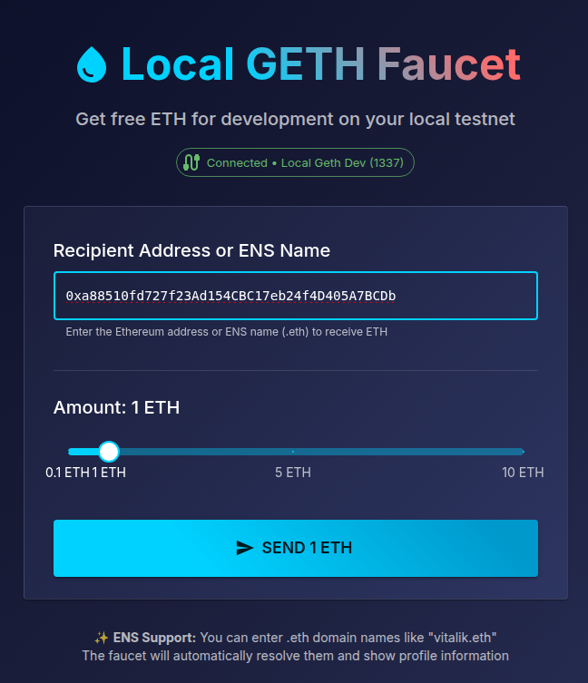
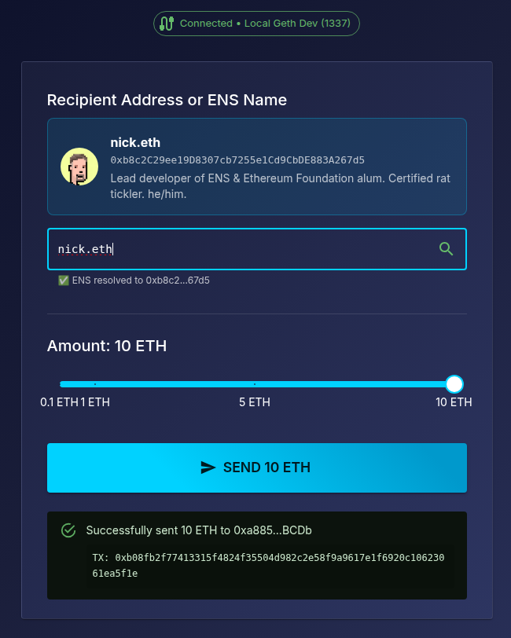
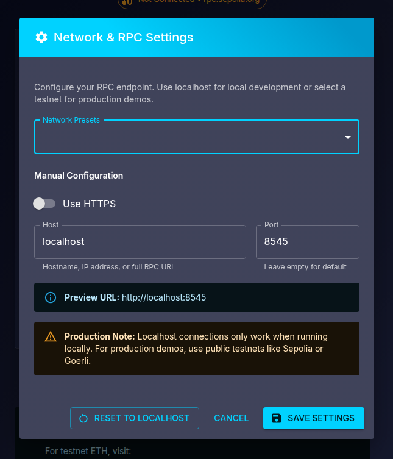

# Geth Dev Faucet

A Go-Ethereum faucet application built with React, TypeScript, Material-UI, and Vite. This tool allows you to easily distribute ETH from your local geth development instance to any Ethereum address.

Why did I build this?
- **Local Development**: Simplifies testing and development with a local geth instance.
- **ENS Support**: Allows sending ETH to ENS names, resolving them automatically (I'm too lazy to copy-paste addresses).

<table>
  <tr>
    <td align="center">
      
      <br />
      <strong>Main Interface</strong>
      <br />
      <em>Clean faucet interface with connection status to your local RPC</em>
    </td>
    <td align="center">
      
      <br />
      <strong>ENS Support</strong>
      <br />
      <em>ENS compliant app, even on your local testnet.</em>
    </td>
    <td align="center">
      
      <br />
      <strong>RPC Settings</strong>
      <br />
      <em>Configure connection with network presets</em>
    </td>
  </tr>
</table>

## Quick Start

### Prerequisites

1. **Node.js** (v18 or higher)
2. **Go Ethereum (geth)** installed on your system

### 1. Install Dependencies

```bash
npm install
```

### 2. Start Local Geth Instance

Start your local Ethereum development node:

```bash
geth --dev --http --http.api eth,web3,dev --http.corsdomain "*"
```

This command:
- `--dev`: Runs in development mode with pre-funded accounts
- `--http`: Enables HTTP-RPC server
- `--http.api eth,web3,dev`: Enables required APIs
- `--http.corsdomain "*"`: Allows CORS from any origin

### 3. Start the Faucet Application

```bash
npm run dev
```

The application will be available at `http://localhost:5173`

## Usage

1. **Enter Recipient**: 
   - **Ethereum Address**: Input a valid Ethereum address (0x...)
   - **ENS Domain**: Enter a .eth domain name (e.g., vitalik.eth, ens.eth)
2. **ENS Resolution**: If you enter a .eth name, the app will:
   - Automatically resolve it to an Ethereum address
   - Display the ENS profile picture (avatar) if available
   - Show the display name and description from ENS metadata
3. **Select Amount**: Use the slider to choose between 0.1 and 10 ETH
4. **Configure RPC** (Optional): Click the settings ⚙️ button to customize RPC endpoint
5. **Send ETH**: Click the "Send ETH" button to initiate the transaction

### ENS Examples to Try
- `vitalik.eth` - Vitalik Buterin's ENS
- `ens.eth` - Official ENS domain
- `nick.eth` - Nick Johnson (ENS creator)
- Any other .eth domain you know!

### RPC Configuration

- Click the ⚙️ settings icon in the top-right corner
- Customize the host and port for your geth instance
- Default: `localhost:8545`
- Supports any host/port combination
- Use HTTPS if your geth instance supports it

### Transaction Settings

- **Default Amount Range**: 0.1 - 10 ETH
- **Network**: Local geth development network
- **Gas**: Automatically estimated by ethers.js
- **ENS Support**: Mainnet ENS resolution with local transaction execution

## Development

### Available Scripts

- `npm run dev` - Start development server
- `npm run build` - Build for production
- `npm run preview` - Preview production build
- `npm run lint` - Run ESLint

## Troubleshooting

### Common Issues

**"Transaction failed" error**
- Ensure geth is running with the correct flags
- Verify the HTTP endpoint is accessible
- Check that CORS is properly configured

**"No accounts available" error**
- Make sure geth is started with `--dev` flag
- The development mode automatically creates a pre-funded account

**Address validation errors**
- Ensure you're entering a valid Ethereum address (starts with 0x)
- Check that the address is properly formatted (42 characters total)

**ENS resolution errors**
- **"missing revert data" or "CALL_EXCEPTION"**: This occurs when trying to resolve ENS on local network. ENS resolution requires internet connectivity to Ethereum mainnet.
- **"ENS resolution requires internet connection"**: Make sure you have internet access. ENS contracts only exist on mainnet.
- **"Network error"**: Check your internet connection and try again. The app uses multiple fallback RPC providers.
- **ENS name not found**: Verify the .eth domain exists and is properly configured.


## License

This project is open source and available under the [MIT License](LICENSE).

## Contributing

Contributions are welcome! Please feel free to submit a Pull Request.

